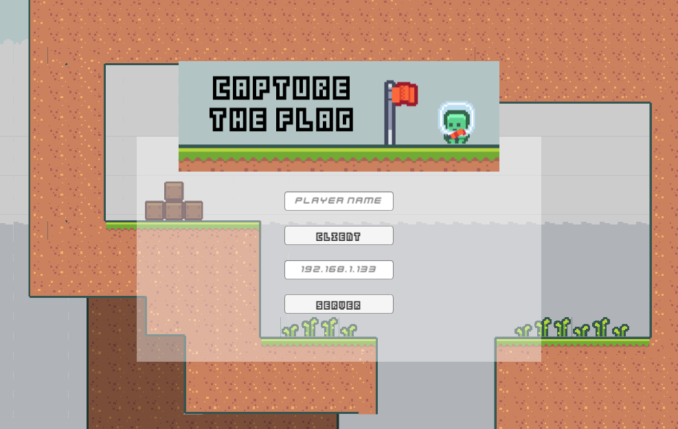
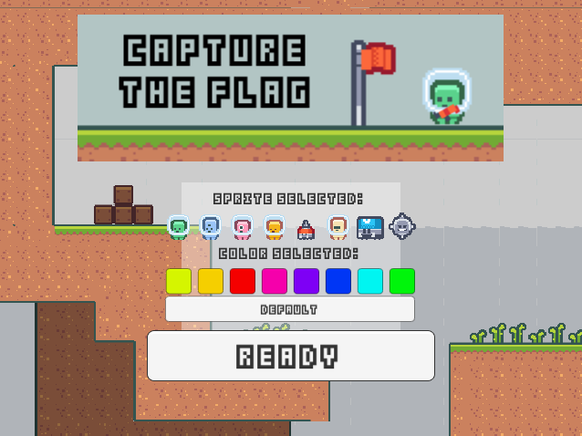
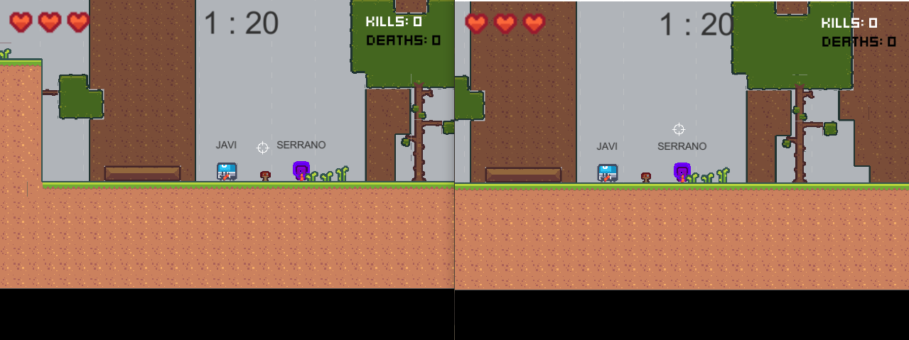
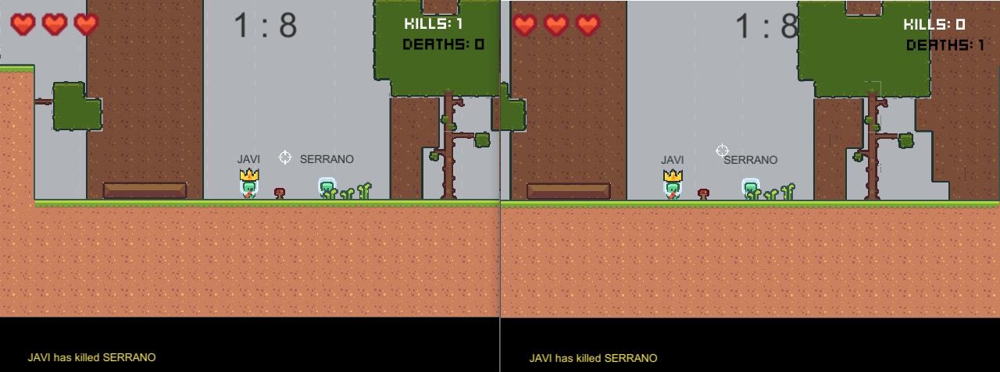
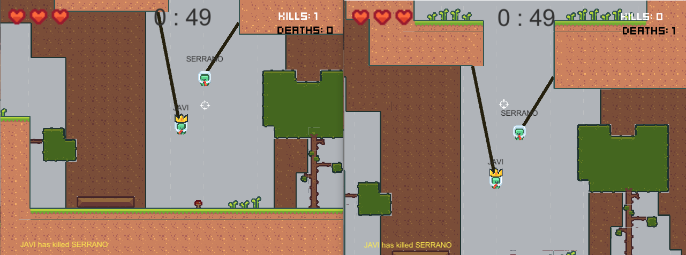
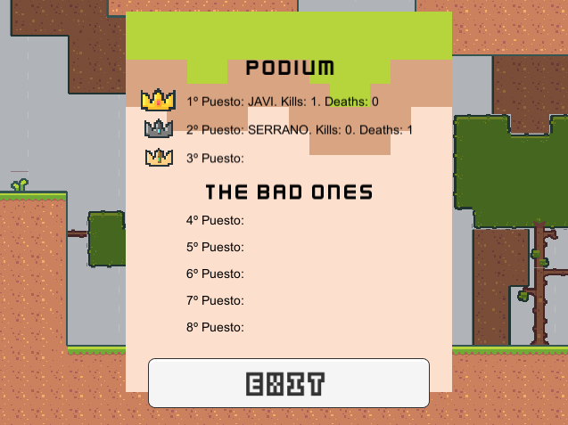

<h1 align="center">CAPTURE THE FLAG [Unity 2020.3.33f1]</h1>

This little project has been coded to learn the basics of Unity Netcode functionalities, based on the existing game Teeworlds.

This project is a university assignment on which a base game is given, so i haven'n done everything. However, this base game is a very simplified version so all the net behaviours are made by myself, which is the goal. To end the context, the base version given by the professor implements the movement, map tiling and hook behaviour, but these only works on Host side, which has to be fixed too to work on Server-Client.

 

<h2>Saying this...what did I implement?</h2>
<ul>
  <li>Server-Client syncronization. Host disappear, only used to quick-testing.</li>
  <li>Character sprite and color selector.</li>
  <li>Player name tag above name.</li>
  <li>Jump correction, as it was uncorrect.</li>
  <li>Match initialization when 2 players are ready. Sets the timer. Players can join if match has started and timer syncronizes too.</li>
  <li>Server disconnects player if is full (max 8).</li>
  <li>In game UI sync. Health and counter of kills and deaths.</li>
  <li>Bullet system that allows to kill players.</li>
  <li>Kill feed system that stores 3 last kills.</li>
  <li>Respawn system. It only respawns player at a position far enough from the others.</li>
  <li>Player with most kills displays a crown to show he is nº1 at the moment.</li>
  <li>Players can hook on walls, ceilings and players.</li>
  <li>End game sync. Displays ranking and despawn players.</li>
</ul>

  

<h2>A walk through the game</h2>

   
   
   
   
   
  

